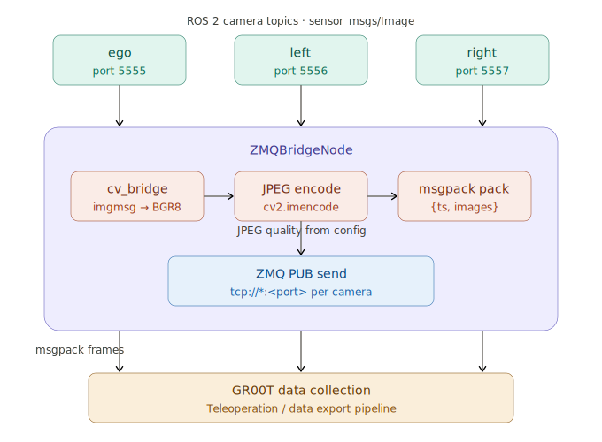

# head_zmq_bridge

Bridges ROS 2 camera topics to ZMQ for GR00T data collection.

## Architechture



## Prerequisites

- The camera node must be running and publishing on the topics listed in `config/camera.yaml`
- `config/camera.yaml` must have the correct camera names and topics for your setup

## Configuration

Edit `config/camera.yaml` before launching:

```yaml
/**:
  ros__parameters:
    cameras: ['ego', 'left', 'right']
    ego:
      topic: /zed/zed_node/rgb/image_rect_color
      zmq_port: 5555
      quality: 80
    left:
      topic: /zed/zed_node/left/image_rect_color
      zmq_port: 5556
      quality: 80
    right:
      topic: /zed/zed_node/right/image_rect_color
      zmq_port: 5557
      quality: 80
```

## Usage

```bash
ros2 launch head_zmq_bridge zmq_bridge.launch.xml
```

Each camera publishes msgpack-encoded frames on its configured ZMQ port, in the format expected by GR00T's data exporter.

